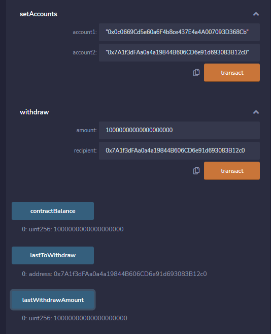

# Berkeley Fintech Module 20 Challenge

Solidity Joint Savings Smart contract to automate financial processes and features including hosting joint saving accounts, ability to deposit and withdraw funds from the account.

## Set up accounts


## Deposit 1 ether


## Deposit 10 ether


## Deposit 5 ether


## Withdraw 5 ether into Account 1


### last to withdraw

### last withdraw amount


## Withdraw 10 ether into Account 2


### last to withdraw

### last withdraw amount


---

## Technologies

This project uses the following packages:

* [Remix](https://remix.ethereum.org/) - Remix is a browser-based compiler and IDE that enables users to build Ethereum contracts with Solidity language and to debug transactions.

* [Solidity](https://docs.soliditylang.org/) - Solidity is an object-oriented, high-level language for implementing smart contracts. Smart contracts are programs which govern the behaviour of accounts within the Ethereum state.

---

## Installation Guide

This project can be run online. There is no need to install any packages locally.

---

## Usage

Please download the project or clone the project using git clone

Please launch remix by typing the following on the browser:

```python
https://remix.ethereum.org/
```

---

## Contributors

Sangram Singh (sangramsinghg@yahoo.com)

---

## License

MIT